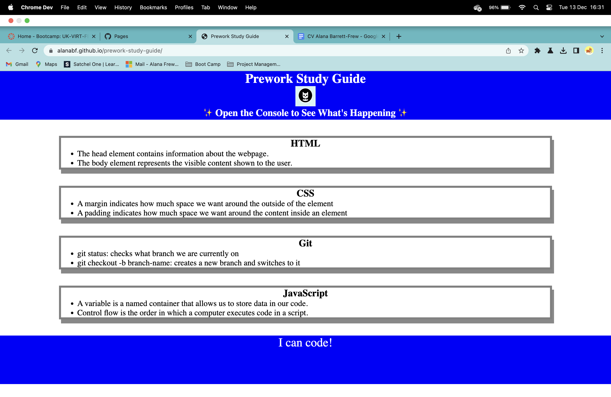

# prework-study-guide
Boot Camp Prework Study Guide for Students
# Prework Study Guide

## Description

- The motivation to create this Prework Study Guide is to help myself and other students to revise, practice and develop the knowledge required to start the course and be up to the same minimum level before starting the Front End Web Development Bootcamp.
- This Prework Study Guide gives the basice knowledge and skills to help embed the basics until it becomes second nature.
- In this Study Guide we learnt about HTML, CSS, Git, JavaScript and Deployment

https://alanabf.github.io/prework-study-guide/ 

## Installation

N/A

## Usage

Each section contains notes about a certain topic, like HTML, CSS, JavaScript, Git. And if we open the DevTools console, we can see the JavaScript running. It will list the topics we learned from prework and choose one topic for us to study first. 

## Credits

N/A

## License

Please refer to the license in the REPO

---